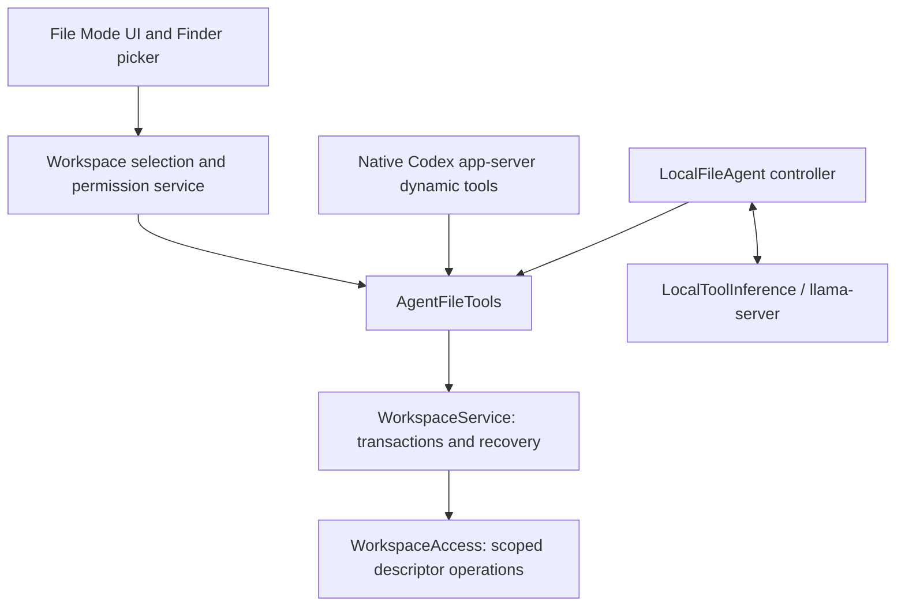

# File Mode

File Mode starts only after **+ → Files** or **Shift + Option + F** opens the macOS file/folder picker. Both entry points call `FileModeCoordinator.activate`. Multiple files and folders can be attached; removing the last attachment returns to ordinary chat. A new chat starts without attachments. Existing conversations retain attachment metadata and bookmarks, but scopes open only when a File Mode request starts.

The input displays a pink File Mode icon, each attachment and its access level. Local and Auto requests use **Read & Edit** access with a per-file safe/protected policy. Notes and simple text documents are edited locally. Protected edits offer Codex when a compatible cloud model is available; otherwise they use a clearly labeled local fallback. **Use Codex** displays a cloud-content disclosure and selects Codex; the user must still send the next request. There is no automatic provider fallback. Cloud File Mode currently supports the existing ChatGPT/Codex connection. Other cloud providers remain available for ordinary chat.


## Shared architecture



`WorkspaceAccess` is the only agent-facing filesystem implementation. `WorkspaceService` owns each task's authority and recoverable changes. Both providers call the same ten tools: `list_files`, `read_file`, `search_files`, `get_file_metadata`, `apply_patch`, `write_file`, `append_file`, `create_file`, `move_file` and `delete_file`. Read-only sessions receive only the first four definitions, and the service independently rejects every mutation. The reserved `AgentCapability.runCommand` and `.runTests` cases provide a future extension point; no command tool is currently exposed.

## Permission boundaries

- The picker creates security-scoped bookmarks for canonical selected locations. Scope lifetimes are balanced. Restoring a conversation does not enumerate its attachments.
- A file attachment authorizes exactly that leaf, not siblings or its parent folder. Multiple attachments have explicit numbered mount names. Redundant selections are normalized.
- Absolute paths, NULs, `..`, descendant symlinks, hard-linked file contents, special files and writes under `.git`, `.codex` or `.agents` are rejected. Internal descendant symlinks are deliberately rejected too; users can attach their target explicitly.
- POSIX `realpath`, verified root identities, directory descriptors, `openat`/`O_NOFOLLOW` and `F_GETPATH` checks enforce the boundary and reject case aliases for mutations. Atomic replacements do not follow destination links.
- No Full Disk Access permission is requested. Existing macOS permissions still apply. Enigma's current app target is not App Sandbox-enabled; security-scoped bookmarks are used for picker-granted locations, and the shared service also enforces scope inside the app. A future App Sandbox distribution must validate individual-file deletion recovery with its entitlement configuration; restoring a deleted leaf never silently grants its parent.
- File names and file/tool contents are treated as untrusted data. They cannot grant permissions, choose a provider, run commands or register tools.
- Removing attachments is disabled during a task. Stop revokes the task's authority and cancels pending deletion confirmation; queued operations check cancellation and authority. Completed edits remain reviewable.

This is a boundary against model-requested access and link/path escapes. It does not isolate the app from another malicious process already running as the same macOS user, or provide database-style locking against simultaneous external editors. Detected external changes produce a conflict instead of overwriting newer user work.

## Codex

`CodexSubscriptionClient` retains the existing authentication, account checks and streamed response events. File requests use the selected folder as the native thread `cwd`, `workspace-write`, a restricted turn policy and native `DynamicToolSpec`/`item/tool/call` requests. For a single file, its parent is cwd metadata only.

`environments: []` disables built-in filesystem/execution environments. Edits travel through native dynamic tools to the shared journal; built-in `apply_patch` and shell execution cannot bypass it. The app declines direct command/file-change approvals and returns no additional filesystem/network grants. Deletion through `delete_file` requires a visible user confirmation. Native call IDs are deduplicated within a thread, and handlers are removed when the turn ends.

Before enabling File Mode, the app generates the installed app-server's experimental JSON schema using the same isolated environment as the connection, with a disposable working directory and no inherited Xcode injection settings. It checks the documented environment-disable and dynamic-tool contract, accepting both root-level and versioned server-request schema layouts. Incompatible runtimes fail closed with a specific compatibility message; process startup failures identify the failed check. Local fallback notices retain the underlying cause instead of reporting every failure as an unavailable/outdated CLI. Ordinary chat keeps its text-only, read-only parameters and has no File Mode handler or attachment cwd. Plugins, hooks, host skill discovery, project instructions and shell/environment access remain disabled. File Mode uses a separate native app-server connection with the same isolated ChatGPT credential store, enabling only the standalone Code Mode tool runner needed by current models. That runner evaluates JavaScript in a bare V8 isolate and forwards registered calls back through `item/tool/call`; it has no filesystem, network or Node APIs. Ordinary chat keeps its runner-disabled connection. Sign-in/sign-out invalidate the File Mode connection so it cannot retain stale authentication.

The retired `workspaceWrite.readOnlyAccess` field is omitted: current CLIs reject it. The filesystem boundary does **not** depend on that field: disabling native environment access and validating every dynamic tool operation in `WorkspaceAccess` are required on all supported versions. Workspace sandboxing alone would otherwise permit broad reads. The live integration test covers the actual signed-in Swift client, including compatibility preparation, thread/turn parameters, tool calls and Undo.

References: [Codex app-server](https://learn.chatgpt.com/docs/app-server). The executable's generated schema is the runtime authority; experimental fields may change.

## Local inference and editing access

`LocalFileAgent` owns the bounded inference/tool loop. `LlamaCPPModelEngine` remains unchanged and inference-only. `LlamaServerVisionEngine` implements `LocalToolInference` for both text GGUF and existing vision models, using llama-server's native OpenAI-compatible `tools` and `tool_calls` with `--jinja`. Assistant text is never parsed for embedded JSON commands.

Each step counts the actual tool-aware rendered prompt tokens before generation. The default response limit remains 1,024 tokens; the entire requested output budget plus a 64-token margin must fit alongside the prompt. The engine rejects context exhaustion separately from output truncation. Catalog context sizes remain in effect (4,096 for Qwen 2.5 3B); imported text models default to 8,192. The opt-in evaluator can override context and output limits without changing the selected model or saved settings.

File tasks use temperature zero and sorted JSON for schemas, attachment context and tool results. The controller executes only the first complete tool call in a response, allowing the model to see a read result before proposing an edit. Any other speculative calls are discarded, including from history. Malformed batches (over eight calls or duplicate IDs) are rejected. IDs are normalized across responses. Assistant text is never executed.

`read_file` returns at most 2,000 characters with offsets, total length and `has_more`; an optional exact `query` locates an excerpt anywhere in the file. Local patches must match text actually returned by a read or search. An inline patch cannot introduce line breaks; intentional structural edits must include complete affected lines. Copying the next unchanged line into a replacement is rejected with guidance to widen the matched range. These conservative local checks can require a more explicit follow-up. UTF-8 and RTF use the same document implementation. `append_file` adds only the requested text, so the model need not reproduce an existing file to append to it.

Recoverable argument errors return specific feedback. Output truncation permits at most two fresh responses; none of the incomplete response's calls execute. Premature completion after a correctable failed mutation can use the same two recovery slots. At most two recoverable tool errors are allowed, and the entire run remains capped at 16 inference steps. Identical successful mutations are deduplicated across IDs and JSON property order. Three identical unproductive results stop the loop. A failed mutation must be resolved before completion is accepted. Conflicts, permission handoffs and terminal filesystem errors are not retried.

Mutation receipts include a bounded read-back and a check of actual journal after-images. Appends return the file's tail; moves and deletions return explicit existence results. Final completion and duplicate acknowledgments also check current bytes and metadata. The service detects changes since the model's read, including canonical read aliases, and preserves newer external edits. This verifies that operations reached disk; it cannot certify that a model chose the right words or fulfilled every part of a natural-language request. Review and Undo remain necessary.

`LocalFileCapabilities.production` exposes the full file-tool capability to selected local models, including imported models without catalog metadata. Model size and a trust allowlist do not determine editing permission. `WorkspaceWriteClassifier` and `WorkspaceWritePolicy` centrally decide each mutation inside `WorkspaceService.apply`, before snapshots or writes. Both providers use this service; no backend maintains its own file-type list.

### Safe and protected writes

| Classification | Examples | Local behavior |
| --- | --- | --- |
| Safe write | Plain `.md`, `.markdown`, `.txt`, `.text`; extensionless notes, plans, checklists, TODO and README; verified files created by Enigma | Edit directly, with snapshots and Undo. No cloud availability check is made. |
| Protected write | Source code, project/configuration files, structured data, unknown formats, hidden settings, instruction files and sensitive credential names | Offer Codex when available. Pause the protected operation until the user approves the cloud disclosure and sends the prepared draft. |
| Protected write with unavailable cloud | Offline Mac, no installed/signed-in compatible Codex runtime, no compatible model, or failed availability check | Allow a local attempt with a visible “Local fallback” notice explaining lower reliability. The same transactional protections apply. |

Configuration/credential names remain protected even with a document extension or app-created provenance. JSON/XML/shebang content cannot become a safe note just by using `.txt` or `.md`. Classification checks both the original and proposed contents, including rename destinations, and resolves the full authorized path so selecting a file inside a sensitive directory does not hide that context. Unknown binary formats remain subject to the existing text-editing limits.

Creation provenance is recorded by the host in recovery journals, with the absolute authorized path and before/after states. Subsequent local tasks recognize an app-created file only when its current contents match recorded app-created contents at that path. Unrecognized external replacements lose this exception. A model cannot assert provenance in tool arguments; a newly proposed unknown-format file must first pass the protected policy before it gains provenance.

Cloud availability is checked lazily, once per local task that requests a protected write. The check uses network status, installed runtime compatibility, account metadata and the native model list. It never starts a model turn or supplies file contents. The host picks an available configured/default Codex model; the cloud consent action shows the disclosure, selects that model and restores the original request to the composer. **The user must still press Send.** Canceling or removing the attachment does not upload anything. Local agents stop at a required cloud handoff rather than retrying or bypassing the protected edit. Protected deletions choose the backend before presenting deletion confirmation.

The real-model smoke tests use these production capabilities and exercise both safe local edits and unavailable-cloud protected fallback. Explicit read-only grants remain supported and independently enforced by the shared service. Filesystem boundaries, snapshot/rollback, cancellation and deletion confirmation continue to apply in every mode.

Settings → Local Models → **Install Local File Tools** installs the existing pinned, checksum-verified llama-server runtime (about 11 MB) when necessary. Already installed compatible model runtimes are reused. Setup downloads the runtime only; it does not transmit attachments. Model inference binds to loopback with an ephemeral API key, runs offline and is unloaded after the file task. Models still need a compatible chat template and reliable tool-calling behavior; unsupported or malformed output fails without executing text as a command.

Reference: [llama.cpp function calling](https://github.com/ggml-org/llama.cpp/blob/master/docs/function-calling.md).

## Rich-text documents

`WorkspaceDocument` handles UTF-8 and text-only RTF for both backends, after the shared access layer has authorized and read the file. RTF reads, search and Review expose visible text instead of RTF control codes. The native AppKit RTF importer/exporter operates on in-memory data only; it receives no URLs or filesystem authority.

`apply_patch` matches a unique substring in the visible text. Unchanged text keeps its fonts, colors and paragraph formatting; replacement text inherits the style at the edited range. `write_file` can replace all visible text while retaining unchanged leading/trailing formatting; separate targeted patches are preferred for multiple edits. `append_file` preserves the preceding text and formatting. `create_file` with an `.rtf` path writes a valid rich-text document from plain text. RTF signatures are recognized even under a text extension and classified centrally as protected unless verified app-created provenance applies.

Malformed RTF and RTF containing embedded images/objects, dynamic fields or tables are rejected before writing because the native text exporter may discard them. These need a text-only copy. Snapshots retain original document bytes and metadata, so Undo restores the exact original RTF, not a re-export. The same rollback and cloud-consent policy applies to RTF as other protected files.

Reference: [Apple RTF export](https://developer.apple.com/documentation/foundation/nsattributedstring/rtf(from:documentattributes:)).

## Changes and undo

Before the first mutation of each affected path, the service writes a durable before/after journal in `~/Library/Application Support/AI Spotlight/File Changes`. Recovery files have mode `0600` inside a `0700` directory. These local recovery copies can contain sensitive file contents and remain until removed; this version does not prune them automatically. They are separate from temporary chat history and remain available after conversation deletion. Bookmarks and conversation IDs are included; full attachment contents are not stored in chat messages by default.

Transactions preflight all paths and mutations before writing, preserve the first before-image across subsequent tool calls, and apply files using atomic replacements. Failed multi-file operations roll back completed steps when the files still match the operation's after-images. Undo restores modified/deleted files, removes new files and restores both sides of a move. Ownership, ordinary permission bits, macOS ACLs and writable extended attributes, including Finder metadata, are retained. If ownership or access rules cannot be restored, replacement fails before committing. Temporary copies have their inherited ACLs cleared before content is written. Kernel-generated authorization/provenance records, inode identity and timestamps are not restored as historical metadata.

After a task, **N files changed → Review / Undo** appears in its conversation. Review shows plain-language file statuses with optional before/after previews. Settings → Local Models → **Review Saved File Changes** also exposes recovery after restart or conversation deletion. Undo checks for newer external changes and stops on conflicts. If a rollback cannot complete safely, its recovery journal remains available instead of silently discarding the before-images. Earlier successful tool operations remain visible if a later independent tool call fails.

## Initial limits

- At most 16 attachments; regular files up to 2 MiB; UTF-8 text, text-only RTF, and text extraction from PDFs up to 200 pages. Office/binary document editing is not supported. A text export can be attached instead.
- `read_file` returns up to 2,000 characters per call with a query or offset for continuation. Search reads on demand, with a 4 MiB text budget, 2,000 entries, 500 entries per directory, depth 16 and 100 matches. Large results must be narrowed by path. Listings are capped at 500 entries.
- Writes create/replace UTF-8 or text-only RTF files; parent directories must already exist. Moves/deletes affect regular files, not entire directory trees. The journal is capped at 64 MiB of file data and attributes per task. A move counts both affected paths.
- File Mode runs separately from Screen/Web Search for now. Enabling it clears those draft tools; combining them later is blocked with a clear message.
- There is no shell, test runner, arbitrary network tool or automatic repository upload. Local safe writes, protected local fallback and Codex edits all stay within explicitly attached locations.

## Verification

Use the repository's isolated unsigned verification helper (do not launch its unsigned app for interactive Screen testing):

```sh
scripts/verify-xcode.sh build
scripts/verify-xcode.sh test
scripts/verify-xcode.sh analyze
```

`WorkspaceTests`, `WorkspaceDocumentTests`, `WorkspaceWritePolicyTests`, `FileAgentTests` and `FileModeUITests` cover picker flows, files/folders, the native panel shortcut including Option-F's `ƒ`, conversation persistence, local/cloud tool dispatch, ordinary chat, Local/Auto editing with Undo, traversal/symlinks/hardlinks, explicit read-only grants, safe/protected classification, metadata-only availability, cloud consent handoff, local fallback, provenance, preflight, rollback, snapshots, restart recovery, modified/deleted/new/moved files, metadata, conflicts and native UI rendering. The screenshot is rendered from native SwiftUI fixtures.

`scripts/verify-file-mode-codex.py` exercises a real installed app-server with an isolated configuration and a loopback fixture Responses provider. It verifies native dynamic-tool dispatch, returning tool results to the next model step, turn completion and the absence of direct filesystem/shell tools. It requires no cloud account or user file contents. Set `AI_SPOTLIGHT_CODEX_PATH` to select the executable. Run it again with `--code-mode` to verify the required isolated runner: no process/require/fetch globals, blocked Node filesystem imports, no unregistered file/shell tools, and successful native dynamic-tool dispatch.

The optional real llama.cpp smoke test is enabled with:

```sh
TEST_RUNNER_AI_SPOTLIGHT_FILE_TEST_MODEL_PATH=/absolute/path/to/model.gguf \
  scripts/verify-xcode.sh test '-only-testing:EnigmaTests/FileModeRuntimeTests'
```

The tests use production local access and per-file policies, read disposable fixtures, write precisely specified edits through the shared tools and verify Undo. They cover a safe text file with no cloud check, plus protected source and RTF fixtures with an explicitly unavailable-cloud fallback. Exact-content assertions remain strict, including the unchanged source-file syntax and final newline. Qwen 2.5 3B Q8 is used for local integration verification. Model output quality still depends on tool-calling support and instructions; Review and Undo remain available for local edits. Cloud integration tests normally use deterministic native transport fixtures and the real app-server probe. Two explicit opt-ins also exercise the app-hosted native CLI check and a real signed-in Codex RTF edit:

```sh
TEST_RUNNER_AI_SPOTLIGHT_CODEX_TEST_PATH=/absolute/path/to/codex \
  scripts/verify-xcode.sh test '-only-testing:EnigmaTests/CodexSubscriptionTests/testInstalledCodexFileModePreparation'
TEST_RUNNER_AI_SPOTLIGHT_CODEX_FILE_SMOKE=1 \
  scripts/verify-xcode.sh test '-only-testing:EnigmaTests/FileModeRuntimeTests/testRealCodexEditsRichTextAndUndoes'
```

The second opt-in uses Enigma's existing ChatGPT sign-in and Codex allowance. It attaches only a disposable synthetic RTF sentence, confirms a precise edit, checks that it remains valid RTF, and verifies byte-for-byte Undo. It never reads the user's test documents.

The earlier Qwen 2.5 3B Q8 smoke run reported an intermittent completion-length failure on the plain-text fixture. That log alone did not establish its cause or a relationship to file size. The separate [reliability evaluation](File-Mode-Reliability.md) records the controlled baseline, implementation, all development attempts, final comparisons and remaining limitations. Run a fresh measurement with `python3 scripts/evaluate-file-mode.py --output /tmp/new-evaluation.jsonl --runs 20`; use `--matrix` for the broader tasks. The harness checks exact files, RTF attributes and byte-for-byte Undo, records failures before asserting, and refuses to overwrite earlier results. It uses only synthetic disposable attachments and the installed selected model. Ordinary tests do not run model evaluations or download models.
