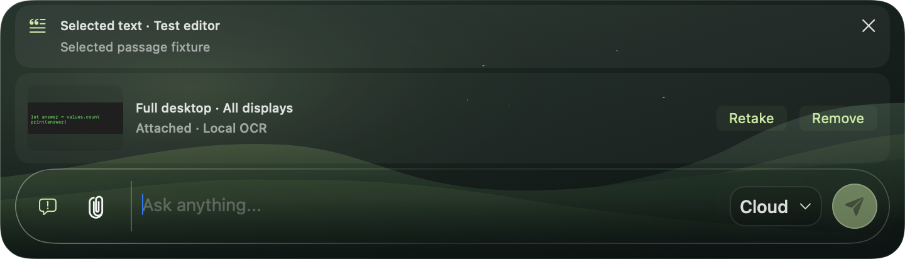
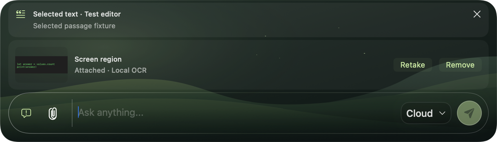
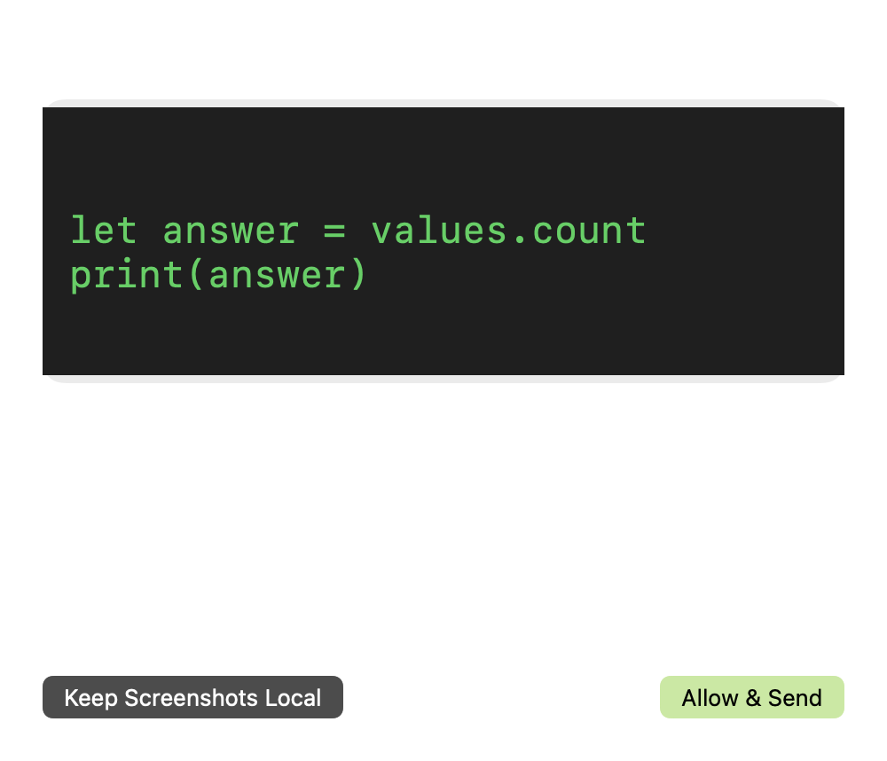
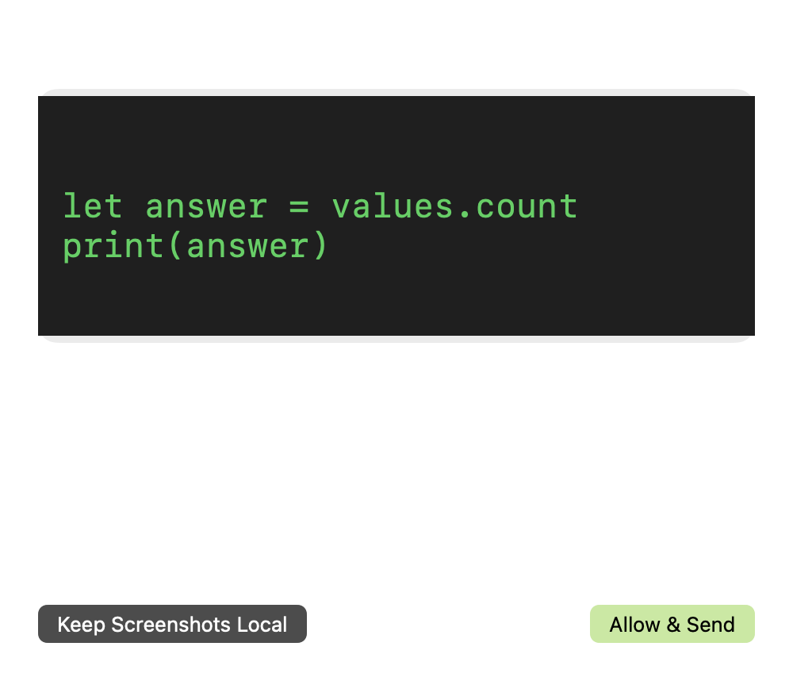

# Screenshot consent and compact attachments — 2026-09-18

This implements Part 2 of the focused audit handoff, on top of Part 1's search
fixes. Chat retention and search authorization are unchanged.

## Behavior

- `/screen` captures the full desktop, including all displays. `/snapshot`
  captures a selected region. The cloud consent sheet names that actual scope
  and the selected provider, with the whole captured image fitted into a preview.
- **Allow & Send** saves the existing global screenshot-upload preference. The
  sheet and Screen settings explain that it covers future captures of either
  type, to whichever provider is selected in Auto or Cloud. **Keep Screenshots
  Local** denies image uploads while preserving the attachment and question.
  A replaced attachment or destination cannot inherit approval from an old sheet.
- OCR still runs locally. Extracted text can be routed to the selected text
  model without image permission; Local mode never falls back to a cloud model.
  Existing permission checks before image requests and after retrieval remain.
- Both composer layouts show a thumbnail, scope, status, **Retake**, and **Remove**.
  A standalone capture in compact selection mode waits for the next question
  without expanding the conversation. Remove excludes the pixels and OCR from
  the next request and preserves any selected-text context and typed question.
- The unused Screen tool toggle and its hidden/off states are removed. The live
  controls are slash commands and the attachment card; Hide Inactive Tools
  cannot hide an attached screenshot. The consent preview window uses the same
  best-effort capture exclusion as the panel, with the existing macOS limitations
  described in [screen-sharing privacy](Screen-Sharing-Privacy.md).

## Regression coverage

`ScreenViewTests` hosts the actual `AppShellView` in the native panel, edits its
real composer, sends commands, and clicks the rendered controls. Synthetic
capture/OCR and provider boundaries keep these cases offline:

- Both standalone commands visibly attach in compact mode. Retake preserves
  capture type; Remove keeps the draft and selected text, and the next provider
  request excludes screenshot data. The input stays inside the resized panel.
- Both consent scopes name their selected providers and show the captured image,
  saved-permission scope, and OCR distinction. Denial preserves the draft and
  attachment without invoking a provider.
- Allow sends the image to the named provider; revocation blocks the next image.
  Replacing the attachment or provider while consent is open grants no permission.
- OCR-only requests need no image consent. Local visual requests with a text-only
  model remain blocked even if global cloud-image permission is enabled.
- Screen Recording denial keeps the compact draft and visible panel without
  capturing or invoking a provider. Existing capture cancellation, late OCR,
  routing, provider serialization, and search regressions remain in the suite.

The obsolete isolated ScreenToolButton render tests are replaced by these live
shell checks. Test screenshots contain synthetic content only.

Native renders use a fixed 3× scale rather than the runner's display scale, and
clicks wait for their rendered controls after sheet/capture restoration. Exact
provider-name OCR uses Gemini and Anthropic to avoid the indistinguishable
OpenAI `I`/lowercase `l` glyph reading; the approval test verifies OpenAI's actual
image request destination. Preview checks preserve both lines of captured text
while allowing OCR's word-spacing differences.

## UI review

These native test renders are checked in as UI documentation. The sheet's native
material background is a separate surface; bitmap caching records its content.

## Local verification

- `scripts/verify-xcode.sh build`: passed.
- `scripts/verify-xcode.sh test`: **535 tests, 10 existing opt-in skips, zero failures**.
- `scripts/verify-xcode.sh analyze`: passed.
- Focused Screen capture/routing/view run: **48 passed**. The final full suite
  includes all new composer checks, existing search regressions, and the
  unchanged welcome and selection tests.
- `git diff --check`: passed.

The follow-up full local run passed all 24 Screen view tests but hit an
intermittent `testChatBecomesEditableImmediatelyAfterEveryWelcomeExit` failure
(the click hit an `NSClipView`). A comparison using the pre-change `51b9b25`
source reproduced the same failure in two of three fresh test-host launches.
Welcome code and assertions remain unchanged; this is a known local verification
limitation, separate from the screenshot cases. The initial CI failures in the
new screenshot checks concerned OCR glyph/spacing differences and control
readiness; their corrected render and native mouse-event helpers retain the
scope, preview, removal, and request-permission assertions above.

The later [test reliability follow-up](Test-Reliability.md) replaces OCR-based
click targeting and fixed welcome/focus delays while preserving these behavior
and permission assertions. The results above describe the original Part 2 runs.

The empty composer retains its existing layout. The shared screenshot card and
its consent sheet are mounted only when an attachment exists; dismissing consent
restores composer focus. Screenshot settings and provider fixtures use isolated
preferences and never grant the owner's real upload permission.

## Manual checks still required

No interactive macOS permission or real capture checks were performed for this
change. Use the stable Apple Development-signed app launched from Xcode, as
required by [AGENTS.md](../AGENTS.md), for:

1. Screen Recording denial, enabling access, restart-required recovery, and
   cancelling the real region picker while retaining the previous attachment.
2. Capturing multiple physical displays in their desktop arrangement and
   checking that the consent preview includes them all.
3. A real image upload to each configured provider, and Zoom or other capture
   clients' treatment of the preview sheet and panel.

Unsigned verification hosts exercise injected capture boundaries only; their
native renders do not claim to verify TCC consent or third-party screen sharing.
