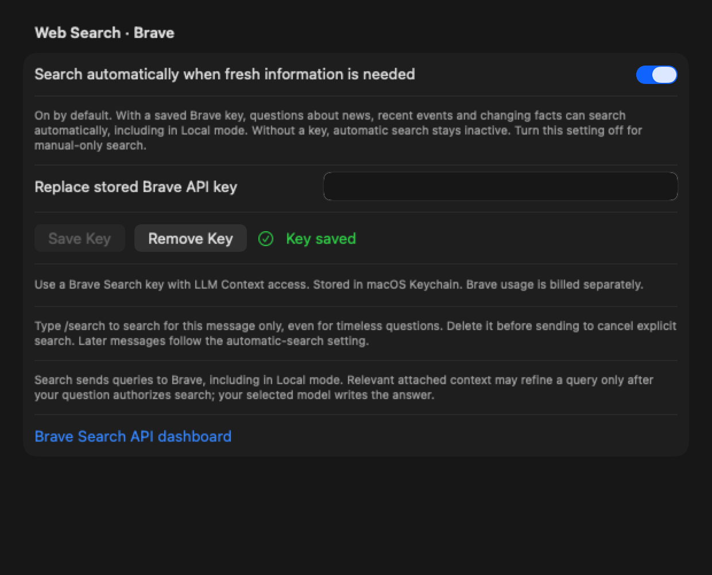

# Web Search

Add a Brave Search API key with **LLM Context** access in **Settings → Cloud & Search → Web Search · Brave**.
The key is stored in macOS Keychain under a separate search service, never in
preferences or chat history. Brave API usage is separate from model-provider usage.

## Automatic search

**Search automatically when fresh information is needed** is on by default in
Settings → Cloud & Search → Web Search · Brave. It becomes active once a Brave key
is saved. Questions such as “What happened in the news today?”, “Latest AI news”,
“What is the latest Swift release?” and “Who is the president of France?” can now
retrieve evidence without `/search`. Weather, market prices, exchange rates,
sports scores and upcoming schedules are also recognized. The composer has no
automatic-search status row. Use the Settings toggle to turn automatic search off
or back on; the preference is saved for later messages, including in Local mode.

The shared `WebSearchPolicy` uses deterministic freshness and lookup cues in the
original current question, before attaching or serializing source content, with
no extra inference call and no simple/complex classifier.
This decision controls whether to retrieve, never the source count, evidence
budget, or selected model. Local (both embedded and server-backed), Cloud and Auto
all resolve it before entering their existing search pipelines. Requests are
independent: an automatically searched question does not turn on forced search
for the following turn.

Quoted text and code are excluded from the decision. Common text transformations,
local file/code references, historical questions and requests such as “don't
search” or “stay offline” avoid automatic retrieval. No conversation history,
OCR, attached file contents or model output can opt a request into search. Screen
questions that do opt in retain the existing query-refinement and image-consent
flow. File Mode remains a separate workflow and does not automatically search.

Turn the setting off for manual-only search. `/search` still forces retrieval
for that message, including timeless questions. Removing the command returns
to the automatic-search preference. Without a saved key, automatic
retrieval is inactive, `/search` is hidden from command suggestions, Help and the
welcome tour, and normal chat continues. Saving or removing a key updates open
suggestions without changing the draft. Missing/rejected keys on a manually typed
explicit search, or any failure after automatic retrieval starts, keep the draft
and show the existing error instead of silently answering without evidence.

The initial policy targets English and favors clear signals. It cannot recognize
every paraphrase or resolve an ambiguous follow-up such as “And yesterday?” from
private conversation history; use `/search` with a self-contained question when
needed. It does not independently verify the freshness of each returned source.

## Explicit search

With a saved Brave key, type **/search** anywhere outside quotes or code to search
for **this message only**. The command stays visible in the draft. Removing it before
sending cancels that explicit request; a later message follows the automatic-search
preference. A standalone `/search` waits for a question and can simply be deleted.
There is no persistent manual search toggle or plus-menu search control.

Combine commands in either order: `/screen /search question` or
`/search /screen question`. After capture, `/search` remains visible in the draft
until the request is accepted. Capture cancellation and search failure preserve
the draft for editing or retry. Quoted examples, backtick code, URLs and paths
remain literal text. See [Slash commands](Slash-Commands.md).

Search may send relevant attached context to Brave **only after the current
question or `/search` authorizes retrieval**. An attachment containing
`"latest news"`, including JSON-escaped quotes, cannot authorize search for
“What does this mean?”. Attachment text can still refine an authorized query.

For requests without Screen, Local mode sends the current question to Brave and
the local model generates the answer. Cloud mode passes evidence to the provider,
including ChatGPT via the existing Codex bridge. Auto uses the same Brave search
and keeps choosing the model based on task complexity and context size. Automatic freshness detection also runs in Local and Cloud modes; it is independent
of Auto model routing.

With Screen attached, the ordinarily selected model resolves the question using
local OCR or the image and generates one focused query. Brave retrieves evidence,
then that same model answers the original question with the screenshot context and
sources. Readable OCR avoids sending pixels when visual interpretation is not
needed. Visual questions use the image in planning and answering. Search controls
retrieval, not model selection; there is no cross-model handoff.

The panel shows Preparing search query and Searching with Brave. Intermediate
planning is hidden and is never saved as a chat turn. Empty, invalid or oversized
queries retain the draft/image rather than silently searching a vague question.
Stop applies throughout. See [Screen](Screen-Skill.md) for consent, context and
migration behavior, and [local model setup](Local-Model-Selection.md) for packages.

Derived queries can contain relevant screen details. Prompts instruct the model
to treat screen content as untrusted data and omit unrelated or sensitive details.
These instructions do not guarantee perfect relevance or redaction. Full OCR,
pixels and history are never attached to Brave. Evidence is fitted to the selected
model's context before the final answer. There is one extra model call for a
screenshot query; its model stays loaded across both stages.

This native panel regression uses deterministic screenshot, search, and response
fixtures; it demonstrates tool integration rather than model answer quality.

Without Screen, only the current question is sent to Brave, normalized to its
400-character / 50-word query limit. With Screen, the refined query must fit the
same limits; trivial answers such as "Yes." are rejected. The final model still receives the full original question. Conversation
history and model credentials are not sent to Brave. Search uses an ephemeral
URLSession with redirects disabled and a 30-second timeout.

The client uses `POST https://api.search.brave.com/res/v1/llm/context` with the
`X-Subscription-Token` header. It supports generic, point-of-interest, and map
grounding entries. Up to ten distinct HTTP(S) candidate sources are retrieved;
empty excerpts and unsafe URLs are discarded. Every route requests an 8,192-token
evidence pool, with at most 2,048 retrieval tokens per source. These limits are independent of question wording.

Preparation reserves output, protocol/system instructions, the complete current
question, and any image allowance first. Roughly half the remaining input capacity
is available for evidence, including its JSON envelope, titles and URLs. The packer
seeds ranked sources, expands their excerpts with fair shares, and redistributes
unused space from shorter sources. Each source is capped at 2,048 measured tokens
or one-third of the payload budget (one-half with two candidates; up to the full
payload share, still capped at 2,048, when only one candidate exists).
Unicode text stays intact. Complete recent chat turns fill remaining space only
after current evidence is chosen. The original question is never truncated.

Normal local preparation uses configured model context, then catalog recommendations,
with 4,096 only for models lacking that metadata. The embedded bridge measures its
actual allocated context and uses the GGUF tokenizer. Server-backed chat renders the
same system/message/thinking template through `/apply-template`, then calls
`/tokenize`. Images keep a separate 4,096-token reserve. An unavailable or malformed
tokenizer falls back to the existing conservative byte estimator; cancellation
never falls back. Cloud routes retain their existing serialization estimates.

Retrieved excerpts are labeled as untrusted data and the model is instructed to
cite exact source URLs. Source links also appear in the reply’s expandable activity
panel independently of the model’s citation formatting. Only sources retained in the actual prompt are
shown or offered for citation; unselected retrieval candidates remain hidden. Only
those links/titles and the normal chat messages are saved; injected excerpts are transient. Existing saved chats remain
compatible. A source link indicates evidence supplied to the model, not independent
verification of every claim in its answer.

Stop cancels both retrieval and generation. Search failures, missing or rejected
keys, rate limits, empty results, and insufficient context preserve the draft and
do not silently produce an answer without search. Error responses are not echoed
into the UI. Requests with neither explicit search nor an eligible automatic-search decision do not call Brave.

The original icon is in `Icons/noun_WebSearch_199704.svg`; the green derivative is
`Icons/noun_WebSearch_199704_green.svg`. The app bundles a vector image asset using
the same geometry. Attribution is retained in the original, derivative metadata,
and bundled third-party notices.

API reference: [Brave LLM Context](https://api-dashboard.search.brave.com/documentation/services/llm-context).

## Verification

`WebSearchTests` covers the API request/response contract, error handling, query
limits, command parsing, credentials, context fitting, all generation routes,
search-off behavior, cancellation/replacement, history compatibility, and the
actual native composer. Tests use deterministic fixtures and do not require a
live Brave key.
Run the repository's shared build, test, and analyze commands from `AGENTS.md`.
A live smoke test additionally requires the owner's Brave key and an installed
local model or configured cloud connection.

The context-aware retrieval update passes build, static analysis, and the full suite:
424 tests, nine optional skips, zero failures. Coverage includes 10-source retrieval,
capacity scaling, half-budget allocation, per-source caps, short-source redistribution,
history priority, model context metadata, endpoint token counting, fallback, image
reserves, and cancellation. An unchanged Codex EOF/timeout test failed during an
earlier local run and passed on the final full run; its assertions were not changed.
Brave and generation fixtures are deterministic; live search quality was not evaluated.

Automatic-search regression coverage includes positive and negative freshness
examples, persisted opt-out and missing-key behavior, all text routes, selected
server models, Screen refinement, OCR isolation, non-sticky requests, unchanged
8K retrieval budgets, prompt-selected sources, failure handling and cancellation
with late results. Tests inject search settings and fixtures; no live Brave key is
needed. The settings screenshot is rendered by the native SwiftUI test host.

Verification for automatic search: build and static analyzer passed; the full
suite executed 435 tests with nine optional skips and zero failures.

Part 1 regression coverage exercises typing and removing `/search` in the real
`AppShellView` editor, explicit search followed by ordinary messages, automatic
search preferences in full and compact selection layouts, and escaped-quote
attachments across Local, Cloud, Auto and Screen. The retired `WebSearchControls`
icon demo and composer status row have been removed; UI tests exercise the live
composer, default-on behavior, Settings opt-out, missing keys and live command
availability when saving or removing a key. Temporary chat history and retention
are unchanged. Native renders are retained as XCTest
attachments and written to `/tmp/Enigma-auto-search.png` and
`/tmp/Enigma-compact-auto-search.png`. They use synthetic selected text and
response/search fixtures, with no live Brave or cloud requests.

The September 18 Part 1 checks reproduced both the sticky command and quoted
attachment authorization bug before the fix. After the fix, `scripts/verify-xcode.sh build`, `test` and `analyze` passed.
The full offline suite ran 531 tests, with 10 optional integration/model checks
skipped and zero failures. The regression matrix confirms that attached freshness phrases do
not call Brave, while explicit search and fresh-information questions still do.
Live search quality and real model/provider responses were not evaluated.

The September 18 composer follow-up passes build, static analysis and the full
537-test suite, with 10 optional skips and zero failures. Both composer layouts
verify default automatic search, preserved opt-outs, no retrieval without a key,
and immediate suggestion updates when credentials change. An initial full run
caught a search-activity screenshot taken mid-expansion; the test now waits for
all three expected labels before asserting them. Its assertions remain intact.
The updated Settings screenshot uses a fixture key; no live Brave calls were made.
